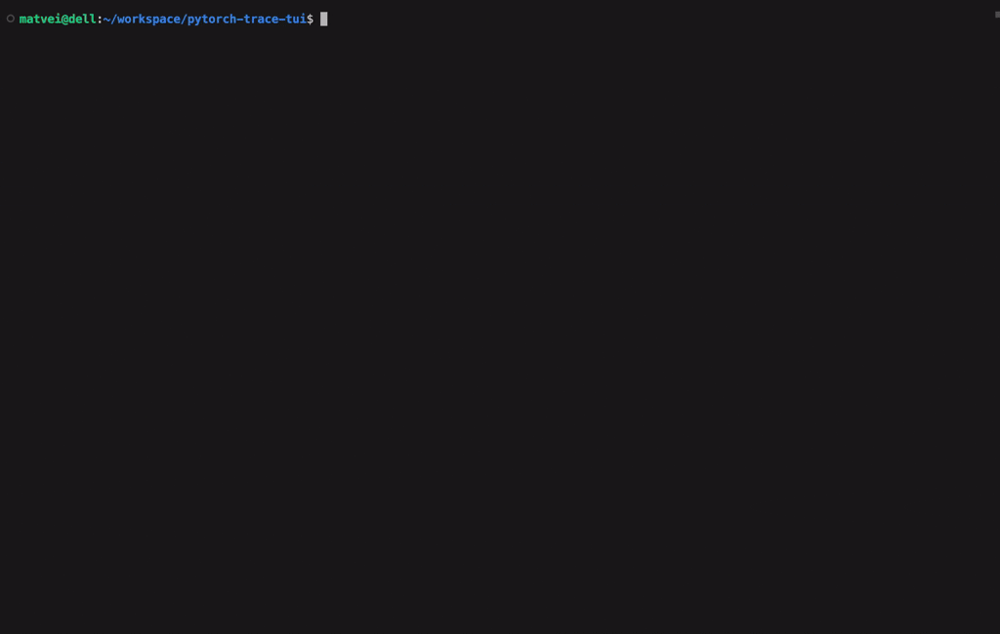

# pytorch-trace-tui



A terminal UI for exploring **GPU kernels** in PyTorch profiler traces, rendered
Perfetto-style as horizontal timeline lanes — one lane per CUDA stream, all
sharing a single time axis.

Reads Chrome-trace JSON produced by `torch.profiler`, filters out everything
except GPU kernels (`kernel`, `gpu_memcpy`, `gpu_memset`), and lets you scrub and
zoom the timeline directly in your terminal. Handles both plain `.json` and
gzipped `.json.gz` traces via streaming deserialization, so 800 MB+ traces load
in seconds.

## Install

Select the version from GitHub releases, replace v0.2.0 below with any version you need and run:

```bash
wget https://github.com/mpashkovskiy/pytorch-trace-tui/releases/download/v0.2.0/pytorch-trace-tui-x86_64-unknown-linux-gnu
chmod +x pytorch-trace-tui-x86_64-unknown-linux-gnu
# make sure you run from folder with traces
./pytorch-trace-tui-x86_64-unknown-linux-gnu
```

Or build and install from source

```bash
git clone https://github.com/mpashkovskiy/pytorch-trace-tui.git
rustup target add x86_64-unknown-linux-musl   # once
cargo build --release
cargo install --path .
```

The project defaults to the statically-linked `x86_64-unknown-linux-musl`
target (see [`.cargo/config.toml`](.cargo/config.toml)), so the resulting binary
bundles libc and runs on any Linux regardless of the host glibc version. This
avoids errors like `version `GLIBC_2.39' not found` that occur when a
glibc-linked binary built on a newer machine is run on an older one.

## Usage

```bash
# Open a specific trace
pytorch-trace-tui my_trace.pt.trace.json.gz

# Overlay several traces to compare them side by side
pytorch-trace-tui baseline.pt.trace.json.gz tuned.pt.trace.json.gz

# Or run with no argument to scan the current directory for
# *.pt.trace.json.gz and pick one — or several — interactively.
# At the picker, enter one number, or several ("1 3" or "1,3") to overlay.
pytorch-trace-tui
```

## Controls

| Key             | Action                          |
| --------------- | ------------------------------- |
| `A` / `←`       | Select previous item in the current lane |
| `D` / `→`       | Select next item in the current lane |
| `W` / `↑`       | Zoom in                         |
| `S` / `↓`       | Zoom out                        |
| `Tab`           | Next lane                       |
| `Shift+Tab`     | Previous lane                   |
| `/`             | Incremental name search (kernels and annotations) |
| `N`             | Show the kernel sequence from the selected kernel (see below) |
| `G`             | Align the other traces to the selected kernel (multi-trace only) |
| `Q` / `Esc`     | Quit                            |

In the **sequence popup** (opened with `N`):

| Key                 | Action                              |
| ------------------- | ----------------------------------- |
| `↑` / `↓`           | Scroll one row                      |
| `PageUp` / `PageDn` | Scroll one page                     |
| `Y`                 | Copy the sequence (tab-separated) to the clipboard |
| `Esc` / `N`         | Close the popup                     |

Every timeline row is a **lane**. A stream contributes a kernel lane, and — if it
has `gpu_user_annotation` events — an annotation lane rendered directly above it,
sharing the same time axis. All lanes behave identically: `Tab`/`Shift+Tab` move
between lanes (annotation lane, then kernel lane, then the next stream), and
`A`/`D` step through whichever lane is selected. When you switch lanes the
selection jumps to the item nearest in time, so you stay in the same region of
the timeline. Search spans both kernels and annotations.

The bottom panel shows full details for the selected item — a kernel (name,
stream, device, start/end/duration, grid/block dimensions, shared memory,
registers per thread, correlation id) or an annotation (name, stream, timing).

Zoom operates on a shared time window across **all** streams — when you zoom in
on a busy stream, other lanes show what they were doing in that same time slice
(or appear empty if they were idle then), just like Perfetto.

## Comparing traces

Open two or more traces at once to overlay them on one shared time axis. Lanes
are interleaved by row — lane 1 of every trace, then lane 2 of every trace, and
so on — and each lane is labelled with the part of its filename that differs from
the others (e.g. `baseline` vs `tuned`).

Because independently captured traces have unrelated absolute timestamps, they
are **aligned** so equivalent work lines up:

- **On load**, traces are shifted so their first shared `gpu_user_annotation`
  starts at the same point. If no annotation name is common to all traces, they
  are left unaligned (a warning is printed) and you can align manually.
- **Press `G`** on any selected kernel to realign: the trace you are in stays
  put, and every other trace slides so its nearest same-named kernel lines up
  under your selection. The header shows what the traces are currently aligned
  on. Alignment is a pure time shift (no scaling), so duration differences —
  exactly what you are usually comparing — stay visible.

## Kernel sequences

Press `N` on a kernel to capture the sequence of kernels from it up to (but not
including) the next kernel with the same name. The popup lists each kernel with a
per-position **median** duration computed across every repetition of that block
in the lane, so you can see the typical cost of a repeated phase at a glance.
Press `Y` to copy the table (tab-separated, paste-ready into a spreadsheet).

## Trace format

Generate a compatible trace from PyTorch:

```python
import torch
from torch.profiler import profile, ProfilerActivity

with profile(activities=[ProfilerActivity.CPU, ProfilerActivity.CUDA]) as prof:
    # ... run your model ...
    pass

prof.export_chrome_trace("my_trace.pt.trace.json.gz")
```

## License

MIT — see [LICENSE](LICENSE).
